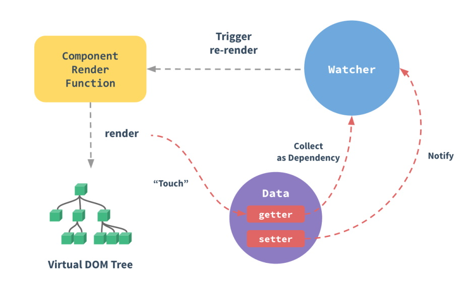

# Reactivity

Reactivity is the mechanism that allows the framework to detect when data used on the page is changed (_mutated_), and to update the page optimally to reflect these changes. It is therefore a crucial mechanism for any web framework, so we are going to analyze it to understand its strengths and limitations.

Vue provides automatic reactivity. That means it is not necessary for the developer to manually trigger the view updates after mutating data. This reactivity is based on 2 features of JavaScript: **getters / setters** for Vue 2 and **Proxies** for Vue 3.

## Getters / setters (ECMAScript 5)

```js
let name = "joe";
const user = {
  get name() {
    console.log("read access to property");
    return name;
  },
  set name(value) {
    console.log("write access to property");
    name = value;
  },
};
```

In JavaScript, the properties of an object can be declared with a getter and a setter, which are functions executed at read and write access to this property. Vue.js uses them by redefining getters / setters for all data and props of the components, in order to identify the consumers of these data as well as the moment when they are updated.

The main limitation of getters / setters is that you must initially know the name of all the variables to be able to assign them a getter / setter. This is why **it is imperative to declare in data or props all the variables used by a component if you want them to be reactive**.

In special cases where it is not possible to declare a variable in advance, for example an `Array` of indefinite length or a `Map`, Vue provides the`Vue.set` or `vm.$set` methods to assign a value to a property while ensuring reactivity.


## Proxies (ECMAScript 6 aka ES2015)

```js
const original_user = { name: "joe" };
const user = new Proxy(original_user, {
  get(obj, key) {
    console.log(`read access to property ${key}`);
    return Reflect.get(obj, key);
  },
  set(obj, key, value) {
    console.log(`write access to property ${key} with value ${value}`);
    return Reflect.set(obj, key, value);
  },
});
```

Proxies are a recent feature of JavaScript that appeared with the ES2015 specification. They allow you to get away from all the limitations of getters / setters, giving complete control over all operations used to manipulate an object. Since they are not supported by older browsers like Internet Explorer, they are only fully introduced in Vue 3.0. This resolves most of the current limitations of reactivity in Vue 2, at the cost of dropping support for Internet Explorer.

## Details of Vue reactivity system


