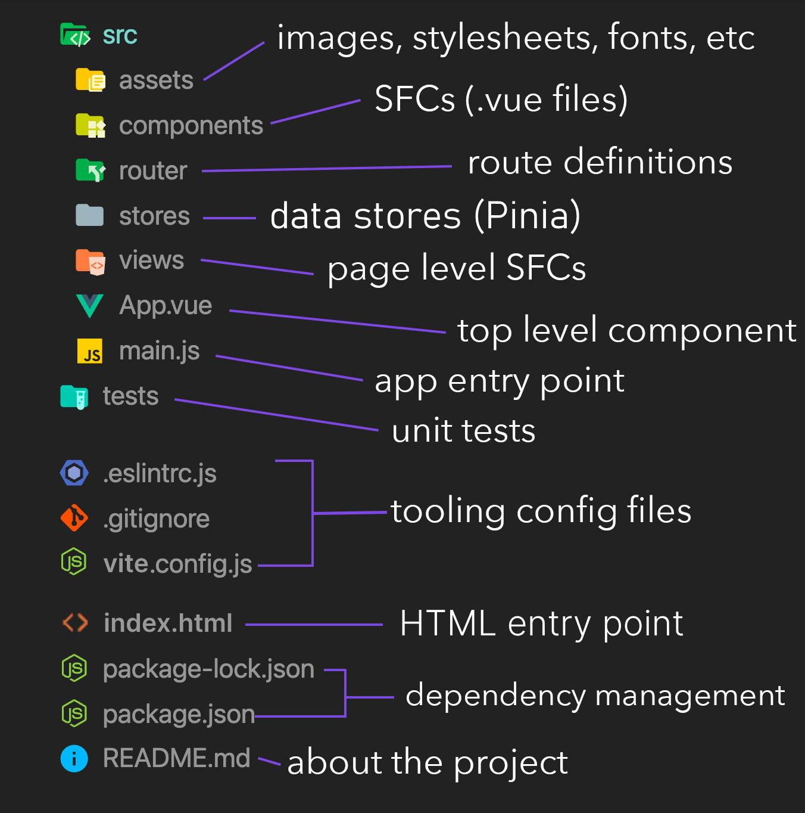

# Vue files

## Overview of a Vue project

The newly created Vue project has the following folders and files:

- `src`: the sources of your project
- `public`: all the content that will be directly put at the root of the web server, without going through Webpack
- `package.json`: the NPM package information of the project (version, dependencies, scripts etc.)
- `vue.config.js`: the configuration file for Vite on this project

Other configuration files for the build tools can also be found here.

In the `src` folder, you have:

- `assets`: static resources (images, files) that will be imported by Webpack within your Vue components
- `components`: your Vue components (distributed by folder by "module" of your application)
- `App.vue`: Your root Vue component, which contains the entire application
- `main.js`: the entry point of the entire application's JavaScript code

Later, you may need to create additional folders in `src` as needed. For example, a `services` folder is commonly found which contains business logic bricks with functions used in several components. Or a `utils` folder to store various utility functions in JavaScript instead of repeating them in multiple places.



## Single File Components \*.vue

- A Vue.js application is divided into several components
- A component is a `.vue` file
- A `.vue` file consists of three optional elements:
  - the `<template>` tag contains the HTML code of the component
  - the `<script>` tag (optional) contains the JavaScript code of the component
  - the `<style>` tag (optional) contains the CSS style of the component

```vue
<template>
  <div>
    <span>Hello {{ who }}</span>
  </div>
</template>

<script>
export default {
  data() {
    return {
      who: "World"
    };
  }
};
</script>

<style scoped>
span {
  color: blue;
}
</style>
```

The script part of the component must export an object with the properties of the component by default. Here we find the property `data` that sets the initial data of the component. The other properties will be discussed in the Components section.

::: tip
Why do you think the `data` property of a component must be a function?

[Answer](https://vuejs.org/v2/guide/components.html#data-Must-Be-a-Function)

Since Vue 3, `data` component option no longer accepts a plain JavaScript object.
:::

## Work with components

The Vue components described above are the building blocks in which you will design your web interfaces. A web application is made of small reusable components, embedded in higher level components to form the layout, the arrangement of your elements on the page. This structure can be described as a **component tree**.


To link the components together, the child components are declared in the parent component template, using their name as a tag. A component can be reused as many times as necessary by including it as follows:

```vue
<!-- MyComponent.vue -->
<template>
  <div>
    <my-child-component></my-child-component>
  </div>
</template>

<script>
import MyChildComponent from "./MyChildComponent.vue";

export default {
  components: {
    MyChildComponent
  }
};
</script>
```

::: tip
The `components` attribute in the script part of the component. The child components used in the template are declared this way to make the dependency links explicit and help with dead code elimination. But you can also declare components globally on your Vue application, so you can use them everywhere without having to declare them manually.
:::

In your Vue project, open `App.vue` and see how the `HelloWorld` component has been integrated into the `App` root component.

## Text interpolation in templates

::: v-pre
The simplest way to insert data dynamically into your components is through text interpolation, using the `{{myVariable}}` syntax. Inside double curly braces, you can specify any valid JavaScript expression:
:::

```vue
<template>
  <p>Order ref. {{ orderReference }} - Total: {{ price.toFixed(2) + "€" }}</p>
</template>

<script>
export default {
  data() {
    return {
      orderReference: "ABCXYZ",
      price: 17.3
    };
  }
};
</script>
```

Interpolation only works on textual content of elements. You can not use it to change the value of HTML attributes or to insert HTML code. For this, you will need to resort to _directives_, which will see in the following section.

## Practical Work: Your first component

The Vue project has been initiated with existing components and styles in `src/components` and `src/assets` folders. Feel free to have a look at them and remove these files if you want, you won't need them.

1. Replace the CSS stylesheet that will serve as basis for all the practical work, downloadable here: [base.css](https://worldline.github.io/vuejs-training/base.css); it must be put it in the `src/assets` folder. Note how it is included in the project with `@import './assets/base.css'` in the `<style>` part of `App.vue`. You can remove the other existing styles.

2. Create a new component `LoginForm.vue` containing the following authentication form:

```html
<div id="login-form">
  <form>
    <h1>Authentication</h1>
    <p>Fill out this form to login.</p>
    <hr />

    <label for="email"><b>Email</b></label>
    <input
      type="text"
      placeholder="Enter your email"
      id="email"
      name="email"
      required
    />

    <label for="psw"><b>Password</b></label>
    <input
      type="password"
      placeholder="Enter your password"
      id="psw"
      name="psw"
      required
    />

    <p><button type="submit">Login</button></p>
  </form>
</div>
```

3. Delete the existing content of the `App.vue` component template, and display the `LoginForm` component instead with `<LoginForm />`. You will also need to declare `LoginForm` in the `components` option of the `App` component.

4. Complete `LoginForm.vue` file to declare the `data` option containing a `title` property. Then use text interpolation in the template to pass the title of the form _"Authentication"_ using variable `title`.
